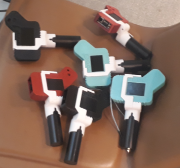
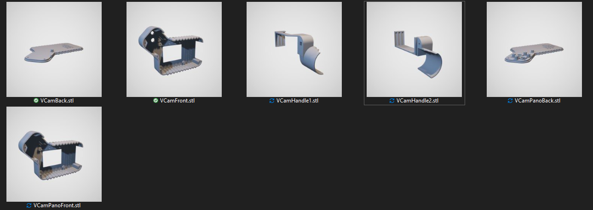

# 3D models for Pilaroids

# [📁 Downloads](https://github.com/usini/pilaroids_3Dmodels/archive/refs/heads/main.zip)

Fork from [Interaction Research Studio - VisionCam Compact](https://github.com/interactionresearchstudio/VisionCam_Compact)

# Changes made:
* Access to USB ports
* Swapped camera for Panorama
* Added a handle made with a [Anker PowerCore 5000](https://us.anker.com/collections/portable-power/products/a1109)

# Components needed
* Raspberry Pi 3b+
* Camera Module v2 8mp (or compatible)
* MicroSD card 16gb (minimum)
* USB Drive
* Adafruit PiTFT 2.2 Hat Mini Kit
* Anker PowerBank 5000mAh
* 15cm USB cable

# Files

Selfie Camera
* VCamBack.stl
* VCamFront.stl

Camera
* VCamPanoBack.stl
* VCamPanoFront.stl

Handle
* [Anker PowerCore 5000](https://us.anker.com/collections/portable-power/products/a1109)
* VCamHandle1.stl
* VCamHandle2.stl

# Screws
* M2 4mm (X6) (Camera/Display)
* M2 6mm (X6) (Case)
* M3 30mm (X1) (Handle)
